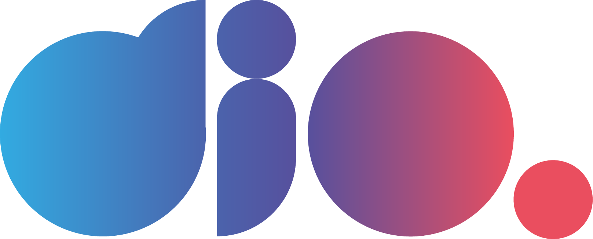

# Digital Innovation One

Código criado para utilização junto a plataforma da Digital Innovation One

## Desafio do Projeto de Métodos de Validação   

# Projeto de Classificação do Conjunto de Dados Wine

Este é um projeto de classificação utilizando o conjunto de dados Wine da biblioteca scikit-learn. O objetivo é treinar um modelo de regressão logística para classificar diferentes tipos de vinho com base em suas características químicas.

## Conjunto de Dados

O conjunto de dados Wine é um conjunto de dados clássico da área de aprendizado de máquina. Ele contém informações sobre a composição química de vinhos de três classes diferentes: 'Class 0', 'Class 1' e 'Class 2'. O conjunto de dados contém um total de 178 instâncias e 13 atributos.

Os atributos do conjunto de dados Wine são:

- Alcohol
- Malic Acid
- Ash
- Alcalinity of Ash
- Magnesium
- Total Phenols
- Flavanoids
- Nonflavanoid Phenols
- Proanthocyanins
- Color Intensity
- Hue
- OD280/OD315 of Diluted Wines
- Proline

## Dependências

- Python 3
- Bibliotecas: scikit-learn, pandas, matplotlib

## Instalação

1. Certifique-se de ter o Python 3 instalado em seu ambiente.
2. Instale as bibliotecas necessárias executando o seguinte comando:

## Resultados

- Matriz de Confusão: [visualização da matriz de confusão]
- Recall para cada classe: [recall para cada classe]
- Acurácia: [valor da acurácia]
- F-score: [valor do F-score]
- Curva ROC: [visualização da curva ROC]

## Contribuições

Contribuições são bem-vindas! Se você encontrar algum problema, tiver sugestões ou quiser adicionar novos recursos, fique à vontade para abrir uma issue ou enviar um pull request.

